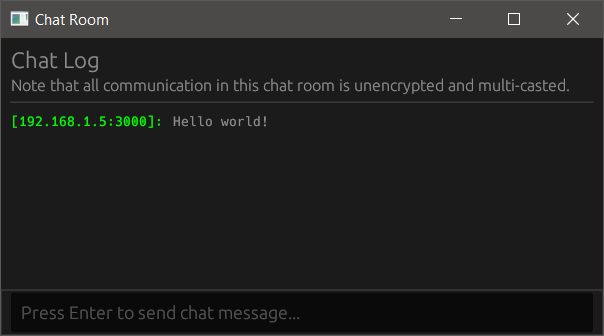

# UDP Multicast Chat Room
UDP multicast provides a mechanism for one-to-many communication in a network. Unlike broadcasting, a multicast may only be received by those subscribed to the particular multicast address of interest. This application implements a basic chat room multicast over a local area network.

> **DISCLAIMER:** All messages in the chat room are sent over _unencrypted_ UDP multicast channels.



# Architecture
For the user interface, this project uses the [egui] framework. In the back-end, the [Tokio] runtime powers all asynchronous workloads: networking, synchronization, and task scheduling.

The main thread runs the user interface logic. On a separate networking thread, the [Tokio] runtime handles incoming and outgoing messages. Information is passed between the two threads via [channels](https://docs.rs/tokio/latest/tokio/sync/index.html).

[egui]: https://www.egui.rs
[Tokio]: https://tokio.rs

By default, the network back-end initializes a socket that binds to `0.0.0.0:3000`. The socket then joins the multicast address `224.0.0.69:3000`. To allow multiple instances of the application to run (on the same hardware), the [`SO_REUSEADDR`](https://docs.microsoft.com/en-us/windows-hardware/drivers/network/so-reuseaddr) flag is enabled.

```bash
# Bind to `0.0.0.0:3000`, then join the multicast address
# `224.0.0.69:3000`, and launch the user interface.
cargo run --release
```
